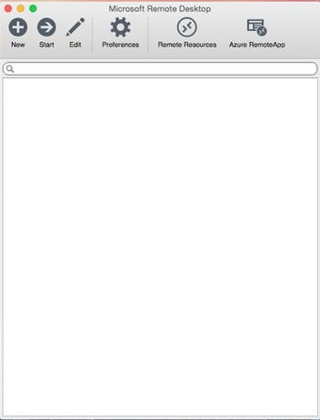
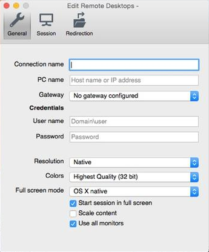

# Upgrade to 19c database Hands-On-Lab Environment setup #

Since we are going to work with upgrading databases, we have prepared an image with several sources database already setup. This image is accessible through Remote Desktop applications and runs in the Oracle OCI Cloud. 

## Disclaimer ##
The following is intended to outline our general product direction. It is intended for information purposes only, and may not be incorporated into any contract. It is not a commitment to deliver any material, code, or functionality, and should not be relied upon in making purchasing decisions. The development, release, and timing of any features or functionality described for Oracle’s products remains at the sole discretion of Oracle.

## Requirements ##

To complete this lab, you need the following account credentials and assets:

- Oracle PTS 19c HOL environment
	- This environment will be pre-setup by your instructor
	- Access details (username, password, ip address) will be made available to you
- Remote Desktop Client compatible with our Remote Desktop Server
	- Windows 7 or lower: Remote Desktop Client version 8.1 or higher
		- [https://support.microsoft.com/en-gb/help/2923545/update-for-rdp-8-1-is-available-for-windows-7-sp1](https://support.microsoft.com/en-gb/help/2923545/update-for-rdp-8-1-is-available-for-windows-7-sp1 "https://support.microsoft.com/en-gb/help/2923545/update-for-rdp-8-1-is-available-for-windows-7-sp1")
	- Windows 10: Remote Desktop Client from the Microsoft Store
		- [https://www.microsoft.com/en-gb/p/microsoft-remote-desktop/9wzdncrfj3ps](https://www.microsoft.com/en-gb/p/microsoft-remote-desktop/9wzdncrfj3ps "https://www.microsoft.com/en-gb/p/microsoft-remote-desktop/9wzdncrfj3ps")
	- MacOS: Only use the Remote Desktop Client provided by Microsoft (available in the iTunes store)
		- [https://apps.apple.com/us/app/microsoft-remote-desktop-10/id1295203466?mt=12](https://apps.apple.com/us/app/microsoft-remote-desktop-10/id1295203466?mt=12 "https://apps.apple.com/us/app/microsoft-remote-desktop-10/id1295203466?mt=12")

> **Please do not use any of the credentials until the lab instructs you to.**

> **Do NOT log into the OCI console and/or create cloud resources until the lab instructs you to.**

## Connect to the remote Hands-On Lab client image ##

The HOL lab was written based on the applications available through a Remote Desktop session on the client. For this, you need to have the Remote Desktop application available on your system.

### Windows ###

Please press the Windows/Start button and search for the following application:

> If you cannot find this application, please start the Microsoft Store on your laptop and install it through the Microsoft store. The application is free to download and install.

After starting the application, the following screen should be visible:

Enter the supplied IP address for your remote environment into the `Computer` text field. No other ports or parameters are needed.

Optionally, you can click on the `Show Options` drop-down box to select additional preferences. 

>Experience has shown us that the best `Display` setting is `Full Screen`. After logging in, start a new browser session in the Remote Desktop environment and read the labs in that location

After pressing the `Connect` button, the Remote Desktop session will be started. This can take a couple of seconds. 

>You can see some warnings regarding certificates; please accept or ignore them as no certificates have been generated for this temporary environment.
>

### MacOS ###

> Issues have been reported with RDP clients from other providers than Microsoft. If you encounter issues with your local RDP client, please install the Microsoft RDP client from the Mac store. See link in the Requirements section.
> 

Locate and start the Remote Desktop application. A similar screen to this will be visible:

Create a new entry for your remote environment:

Enter the supplied IP address for your remote environment into the `PC Name` text field. No other ports or parameters are needed.

>Experience has shown us that the best way to work is in `Full Screen` mode. After logging in, start a new browser session in the Remote Desktop environment and continue using the labs through the Remote Desktop browser.

>You can see some warnings regarding certificates; please accept or ignore them as no certificates have been generated for this temporary environment.

## Login to Linux system after connection ##

After a succesful connection, you will see another login screen:

Please enter the supplied username and password for this session. After pressing the `Ok` button, you will login to the Linux environment and see the Remote Desktop desktop.

In case of issues, please contact your instructor.

## Optional: Using SSH to connect to the image ##

By default, the SSH ports are enabled and the SSH daemon is running in the image so you can connect your favorite SSH client to the image as well for all non-graphical steps in the labs.

> **The ssh server only accepts public/private key authentication. 
> It is NOT allowed to change the authentication method to accept passwords !**

You are allowed to add your own public key to the `authorized_keys` file in the image. It is out of the scope of this hands-on lab to demonstrate how to do this. 

## Next step: Lab 1 - Install 19c ##

**All labs depend on the 19c installation in lab 1**

- There is no dependency between the labs after lab 1
- Please continue with your hands-on experience by running the steps in Lab 1.
- After finishing Lab 1, continue as instructed to the next Lab or choose an interesting lab
	- If one lab is executing the upgrade, you can start another Lab if you want to
	- Every Lab has its own instances and versions so even the upgrade can run in parallel

## Acknowledgements ##

- **Author** - Robert Pastijn, Database Product Management, PTS EMEA - April 2020

